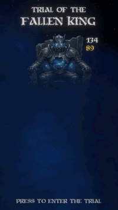

# 🗡️ Trial of the Ruined King

Survive waves of increasingly difficult attack patterns in a grid-based arena.  
Dodge telegraphed attacks, chase high scores, and collect gold as the challenge ramps up.  

## 🎮 How to Play

Move across the grid to avoid incoming attacks. Each attack is telegraphed before it lands, giving you a short window to react.

Your goals:
- 🧭 Stay alive as long as possible  
- 💰 Collect gold coins scattered across the arena  
- 📈 Push your score higher with every second survived  

## 🎥 Demo

  

## 🛠️ Technical Overview

Built with **Domain-Driven Design** and **Clean Architecture**.

**Project Structure:**

The project is split into a **domain core** and multiple **adapter layers**, following Clean Architecture principles. This keeps the game logic independent from Unity and easy to test.

- `Domain/`  
  Contains the core game logic and rules.  
  This includes entities such as the Player, Arena, and Attacks, as well as domain services and events.  
  This layer has **no dependencies on Unity** and can be tested in isolation.

- `Adapter.Gameplay/`  
  Acts as the bridge between the domain and the gameplay layer in Unity.  
  It translates domain concepts into something Unity can execute (e.g., triggering actions, updating state based on input).

- `Adapter.GamePresentation/`  
  Responsible for visuals and feedback.  
  This includes rendering, animations, UI, and playing effects based on domain events.

- `Adapter.Bootstrap/`  
  Handles application startup and wiring.  
  This layer is responsible for initializing the system, connecting dependencies, and setting up communication between the domain and adapters.
